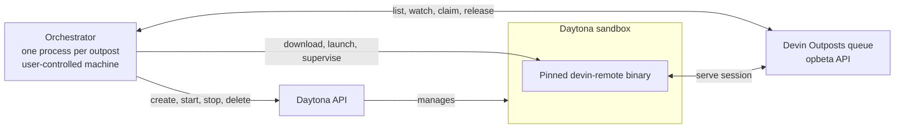
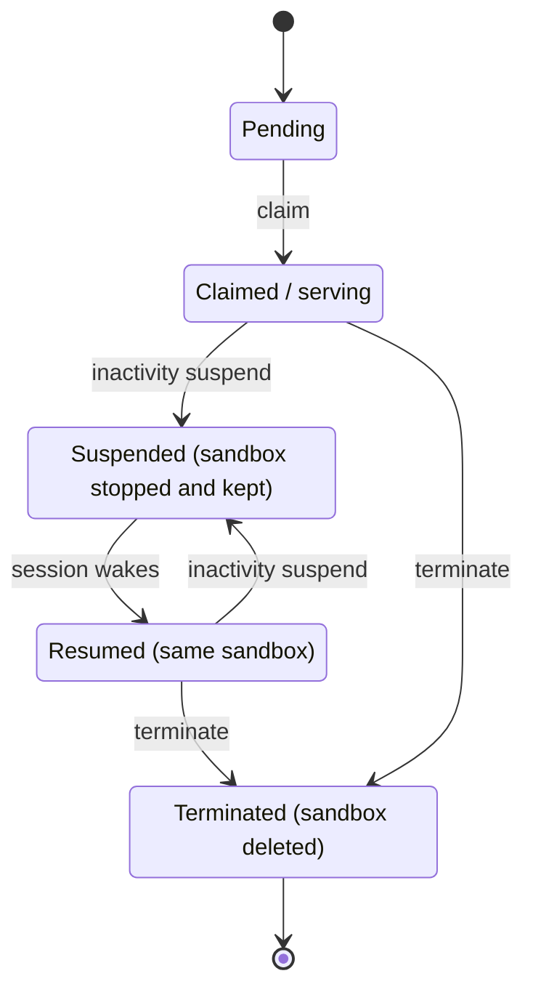
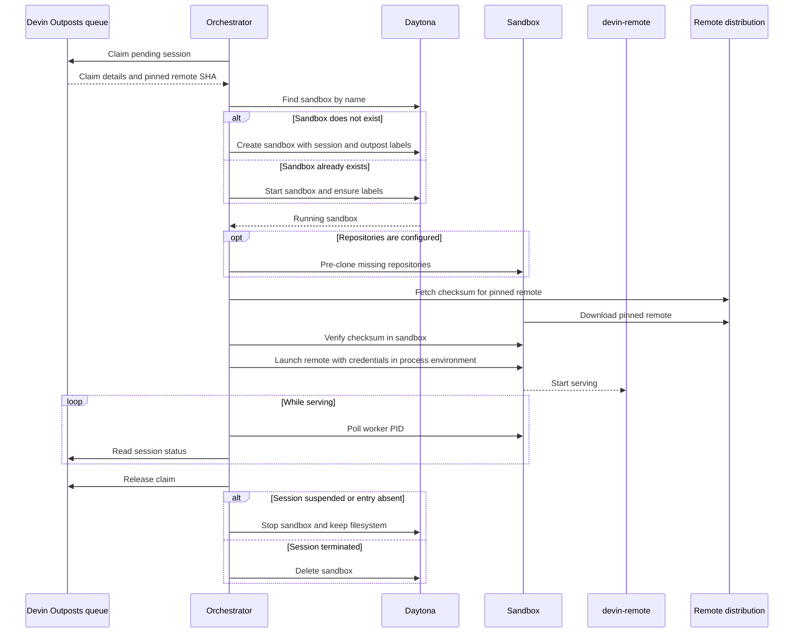

# Architecture

## Overview and component map

Devin Outposts connects a Devin session queue to compute supplied by the operator. One orchestrator process runs for each outpost on a user-controlled machine. It watches the early-access (`opbeta`) queue, claims runnable sessions, and reconciles each session with a Daytona sandbox. Inside that sandbox, a checksum-pinned `devin-remote` process connects the session to its Linux or Windows environment.

The config loader (`devin_outposts.config`) builds the outpost, sandbox, repository, platform, and credential settings from the environment. The queue client (`devin_outposts.queue`) deliberately exposes a small set of list, watch, get, claim, and release operations, and `devin_outposts.queue_shapes` absorbs payload drift on its behalf. The orchestrator (`devin_outposts.orchestrator`) turns queue state into lifecycle actions, while platform-specific worker launchers (`devin_outposts.worker`, `devin_outposts.worker_linux`, `devin_outposts.worker_windows`) prepare and supervise the remote process inside each sandbox. The [code map](../README.md#code-map) in the README summarizes every module in one line.

## Session lifecycle

Suspension is driven by inactivity on Devin's side. A suspended session is visible in the queue only transiently and then vanishes, so an absent queue entry does **not** mean that the session terminated. The orchestrator releases the claim and stops the sandbox but keeps its filesystem; when the session wakes and returns as pending, the same sandbox is started and reused. An observed terminated state instead causes the sandbox to be deleted.

Serving sandboxes use `auto_stop_interval=0`. Daytona therefore does not independently stop an active worker: the orchestrator owns the stop and start decisions needed to preserve suspend and resume semantics.

## Serve sequence

## Design decisions

### Orchestrator-owned sandbox lifecycle

The orchestrator, rather than Daytona's automatic stopping, decides when serving sandboxes start, stop, and are deleted. This keeps a running session alive, retains its disk during suspension, and removes it only after termination is observed.

### Pinned-SHA remote with in-sandbox verified download

Each queue entry selects a remote binary by SHA. The launcher fetches its published checksum, downloads the binary inside the sandbox, and verifies it before execution. Pinning provides supply integrity, and downloading in the sandbox avoids unreliable host uploads of large binaries, particularly on Windows.

### Windows detached launch and PID file as truth

The Windows worker launcher (`devin_outposts.worker_windows`) starts the remote as a detached process and records its PID in the sandbox. Synchronous execution is killed server-side after roughly 40 seconds even when the child starts successfully, so launcher completion is not evidence that the worker stopped. PID-file polling is the source of truth, and the detached first launch also has time to absorb a Windows Defender scan of the downloaded binary.

### Queue tolerance layer

The queue API is early-access and its payload shapes can drift. Fields may be top-level or nested under status, metadata, or spec objects, and responses may use mappings or objects. A narrow tolerance layer (`devin_outposts.queue_shapes`) normalizes those variations so lifecycle code reads one stable shape.

### Sandbox names and labels as the reconciliation key

A sandbox is named from its safe session identifier and labeled with its session and outpost identifiers (`devin_outposts.sandbox`). Those values let a restarted orchestrator find the same sandbox, reattach a claimed worker, and limit reconciliation to resources belonging to its outpost.

### Janitor

A periodic janitor in the orchestrator performs a label-scoped sweep, excluding sessions currently served by this process. It stops suspended sandboxes and removes stale sandboxes whose sessions have ended, without sweeping unrelated Daytona resources.

### Pending poller

A lightweight poller lists pending queue entries every few seconds and reconciles them. The watch stream is the primary signal, but it has been observed to withhold events while staying open; without the poller a new session could wait out the full watch cycle before being claimed, longer than Devin waits for an outpost machine.

### Secret handling

Worker credentials are passed through the process execution environment rather than interpolated into command strings, and configured secrets are redacted from exception logs. The Devin Outposts machine token and the Daytona API token have separate roles and are not interchangeable.

## Known platform caveats

- On Windows, the desktop VNC tunnel can start while its stream still does not render in the Devin UI **Desktop** tab. This is an upstream integration issue.
- On Windows, ffmpeg `gdigrab` desktop capture fails from the non-interactive service session.
