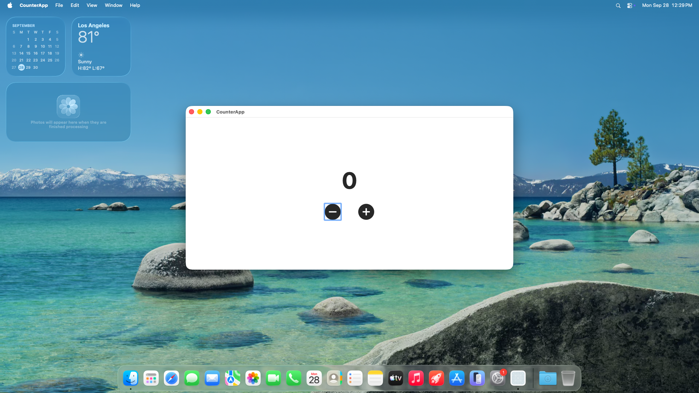

# macOS App Development (use.computer)

## Overview

This example demonstrates building, running, and testing a real macOS app end-to-end inside a real macOS sandbox. It uses [use.computer](https://use.computer) to provision a macOS sandbox, then assembles a small SwiftUI counter app into a real Xcode project with [XcodeGen](https://github.com/yonaskolb/XcodeGen), builds it, launches it directly on the sandbox's own desktop (no simulator involved), runs its XCTest suite, and prints a parsed pass/fail summary.

<p>
  
</p>

## Features

- **Real macOS sandbox:** Created on your use.computer reservation, torn down when the script finishes
- **Real Xcode project, built from scratch:** [XcodeGen](https://github.com/yonaskolb/XcodeGen) turns a project spec into an `.xcodeproj` at runtime — nothing is checked into this repo
- **Runs as a native app, no simulator:** The built `.app` is launched directly with `open`, the same way a user would run it — there's no iOS Simulator layer to boot or manage
- **Automated test run with parsed results:** `xcodebuild test` output is parsed into a clean pass/fail summary, with a non-zero exit code on failure
- **Screenshot for manual verification:** After launch, a full-screen screenshot of the sandbox is downloaded, since the test suite proves the app's logic but not that its UI actually renders correctly
- **Optional full session recording:** Set `RECORD_SESSION=true` to record the whole run and download it as `recording.mp4`
- **Real example artifacts included:** [`example-screenshot.png`](example-screenshot.png) and [`example-recording.mp4`](example-recording.mp4) from an actual run are checked into this folder (see [Example Output](#example-output))

## Prerequisites

- **Node.js:** Version 18 or higher is required
- **npm:** Included with Node.js installation

## Environment Variables

To run this example, you need to set the following environment variables:

- `USE_COMPUTER_API_KEY`: Required to control macOS sandboxes. Get it from [use.computer](https://use.computer)
- `USE_COMPUTER_RESERVATION_ID`: Required. The id of an active Mac Mini reservation to create the sandbox on — reserve one from the [use.computer dashboard](https://use.computer) (see [Reserving a Mac Mini](#reserving-a-mac-mini) below)
- `RECORD_SESSION`: Optional. Set to `true` to record the whole sandbox session and save it to `recording.mp4` when the script finishes

Create a `.env` file in the project directory with these variables (see `.env.example`).

## Getting Started

### Reserving a Mac Mini

macOS sandboxes run on dedicated Mac Minis reserved through use.computer — reservations run 24 hours or more, billed for the full duration regardless of how many sandboxes you create with it, and each Mac can host up to 2 macOS sandboxes at once. This script expects a reservation to already exist rather than creating (and re-billing) a new one on every run. See [use.computer](https://use.computer) for current pricing.

1. Sign up at [use.computer](https://use.computer) (a starter credit is included, no card required) and grab your API key from **Settings**.
2. From the [use.computer dashboard](https://use.computer), reserve a Mac Mini and copy its reservation id.
3. Put both values in your `.env` file as `USE_COMPUTER_API_KEY` and `USE_COMPUTER_RESERVATION_ID`.

Reserving is also possible directly from code instead of the dashboard — see the [use.computer Quick Start](https://docs.use.computer/docs/quickstart) for the SDK call and reservation options.

This example also assumes the Mac Mini image already has a full Xcode install (not just the Command Line Tools) and Homebrew. The script installs [XcodeGen](https://github.com/yonaskolb/XcodeGen) itself via `brew install xcodegen` if it isn't already present.

### Setup and Run

1. Install dependencies:

   ```bash
   npm install
   ```

2. Run the example:

   ```bash
   npm run start
   ```

## How It Works

1. A macOS sandbox is created on your existing reservation via `use-computer-sdk`
2. If `RECORD_SESSION=true`, screen recording is started on the sandbox
3. The hardcoded project scaffolding (`project.yml`), app entry point, `ContentView.swift`, and `CounterAppTests.swift` are uploaded to the sandbox
4. `xcodegen generate` turns the spec into a real `.xcodeproj`
5. `xcodebuild` builds the app against the `platform=macOS` destination — no simulator to pick or boot, since a macOS app runs natively
6. The built app is launched directly with `open`, the same as double-clicking it in Finder
7. A full-screen screenshot of the sandbox is captured and downloaded for manual visual verification (via the SDK's `mac.screenshot.takeFullScreen()`), since the test suite proves the app's logic but not that its UI actually renders correctly
8. The app is quit so it doesn't conflict with the test run below, then `xcodebuild test` runs the XCTest suite against the same `platform=macOS` destination, writing a `.xcresult` bundle
9. The `.xcresult` bundle is zipped and downloaded, and the test output is parsed into a pass/fail summary printed to the console
10. If recording was started, it's stopped, downloaded, and saved as `recording.mp4`
11. The sandbox is closed

## Configuration

### App Source

The app, its entry point, and its tests are hardcoded string constants in `index.ts`:

- `CONTENT_VIEW_SWIFT` — the SwiftUI view and a plain `Counter` struct implementing the counting logic (clamped at zero)
- `APP_ENTRY_SWIFT` — the `@main` App entry point
- `COUNTER_APP_TESTS_SWIFT` — the XCTest case exercising `Counter`

Edit these to build and test a different app — nothing else in the script depends on what they contain, as long as the app target is still named `CounterApp` (or you also update `APP_NAME`/`BUNDLE_ID`).

### Xcode Project Configuration

The XcodeGen spec is defined in the `PROJECT_YML` constant in `index.ts`. It configures a `CounterApp` application target and a `CounterAppTests` unit test target, both targeting `platform: macOS` with code signing disabled (not needed for local, unsigned builds). Edit it to change the deployment target, add resources, or add more targets.

### Recording the Session

Set `RECORD_SESSION=true` in your `.env` file to record the entire sandbox session and save it to `recording.mp4` when the script finishes (whether it succeeds or fails). This is off by default since most runs only need the screenshot and test results.

## Example Output

This is the actual console output from a real run against a use.computer Mac Mini reservation, with `RECORD_SESSION=true` (raw `xcodebuild`/`brew` output in between is trimmed for readability — the script itself doesn't suppress it):

```
Creating a macOS sandbox...
Sandbox ready. Watch it live at: https://api.use.computer/vnc?sandbox=sb-766888fb7cac1d256fcf1cccc239c020&token=***
Recording started: rec-fe4bbf81387d8dee
Xcode 26.4.1
Build version 17E202
Uploading project files...
Ensuring xcodegen is installed...
Generating Xcode project...
Building app...
** BUILD SUCCEEDED **
Launching app...
Capturing screenshot...
✓ Screenshot saved to screenshot.png
Running tests...
** TEST SUCCEEDED **
Archiving test results...
✓ Test results saved to TestResults.xcresult.zip

Test Results
============
[PASS] CounterAppTests.testDecrementStopsAtZero (0.001s)
[PASS] CounterAppTests.testIncrement (0.001s)
[PASS] CounterAppTests.testIncrementThenDecrement (0.001s)
------------
SUCCEEDED: executed 3, 0 failures (0 unexpected), 0.003s
Stopping recording...
✓ Recording saved to recording.mp4
Closing sandbox...
```

Open [`screenshot.png`](example-screenshot.png) to see the app running as a native window on the sandbox desktop, and unzip `TestResults.xcresult.zip` (or open it directly in Xcode) to inspect the full test report.

### Recording

[`example-recording.mp4`](example-recording.mp4) is the actual `recording.mp4` from the run above, capturing the entire sandbox session — Xcode project generation, the build, the app launching, and the test run — useful for a full visual audit beyond the screenshot above. (This and `example-screenshot.png` above are checked into the repo purely to illustrate output; the script itself always writes to `screenshot.png`/`recording.mp4`, which are gitignored.)

## License

See the main project LICENSE file for details.

## References

- [use.computer Documentation](https://docs.use.computer)
- [use.computer Quick Start](https://docs.use.computer/docs/quickstart)
- [XcodeGen](https://github.com/yonaskolb/XcodeGen)
- [xcodebuild documentation](https://developer.apple.com/documentation/xcode/building-and-running-an-app)
